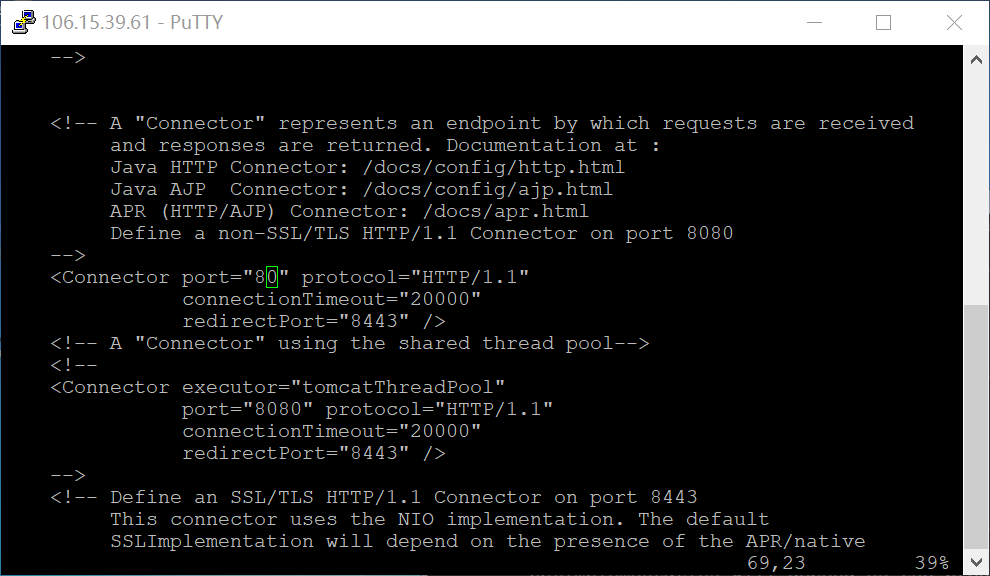
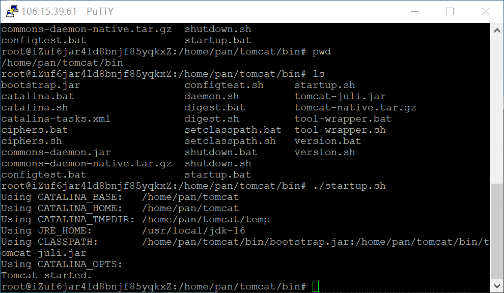
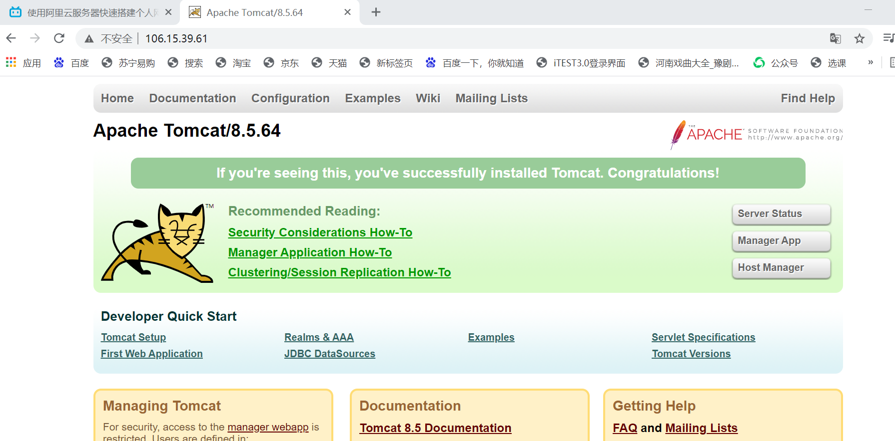

# 服务器

2021/4/1
IP: 106.15.39.61

---


## 虚拟机安装

---
### 解压文件

```shell
tar -zxvf xxxx
```

### JDK环境变量配置
```shell
vim /etc/profile
```

> JDK安装位置
/usr/local/jdk-16

- 在profile末尾加入:
  > export JAVA_HOME=/usr/local/jdk-16
  export PATH=\$JAVA_HOME/bin:\$PATH
  export CLASSPATH=.:$JAVA_HOME/lib/dt.jar:\$JAVA_HOME/lib/tools.jar

- 重启就生效了

### tomcat配置
> 外网通过80端口访问主机的服务
- 进入/home/pan/tomcat/conf
  ```shell
  vim server.xml
  ```
- 修改图示位置为80端口（我们设置的访问端口为80端口）
  

- 进入/home/pan/tomcat/bin
  - 此目录存放了启动文件和关闭文件，输入命令启动
  
  - 此时在浏览器中输入主机域名，如果能访问到tomcat的界面，说明tomcat已经成功运行
  

### 上传网站文件
- 之前打开看到的界面就位于/home/pan/tomcat/webapps/ROOT中，因此将其中的文件完全删除，然后上传自己的文件即可
  -  删除命令： rm -rf ./*